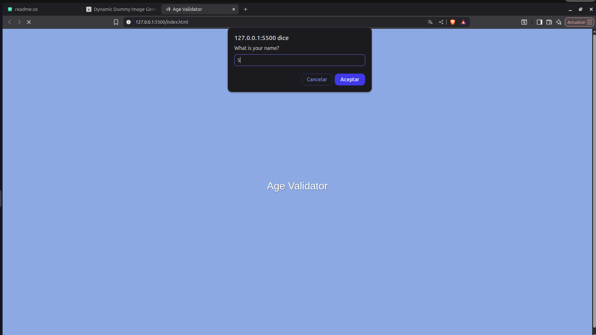
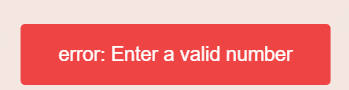

# Age Validator

This code is designed to be able to validate the age of our user and determine if they are able to access it or be retringed for it. The system requests from our user the name and then the age. It internally validates if the character provided is a number or not.


## Demo:
 


## How to run?

1. Clone the project or simple open in the web.

```bash
  git clone https://github.com/co12bg-design/Userstory1JS.git
```

2. Open it in Visual estudio code and use the liver server feature locating the index.html>rightclick>and click o liver server.


3. Put your name in the text box is pop up in the top of the screen. 
4. then it will validate your age, first it will check if you are uising a number or not if you put an invalid number, it will request it again. 
3. depdning if you are older than 18 or minor it will give you the respective message. 

## Js principal features in the Code:

-We define the constant name fro them use the propmt to add information: 
` const name = prompt("What is your name?"); `

-Then we define the constant Age and with the help of number we validate that the user must add a number. 

` const age =   Number(prompt("Welcome! ${name} How old are you?" ));`

We use the conditionals to:

1. If the data provided is non a number it will pop up a error message in the console:

` if (isNaN(age)||age <= 0) {
console.error("Error: please enter a valid number");
showToast();} `

And in order the user will eb able to this error message 



we implement a HTML feature with the fuction toast:

`const toast = document.getElementById('toast');`

then we define when and where the message should be showed in thsi part and in the css folder. 

` const showToast = () => {`
    `toast.classList.add("show");`
    `setTimeout(()=>{`
        `toast.classList.remove("show");`
    `},3000)`
`};` 

2. we use the conditional else if to define the second action when the user enter a number lesser than 18:

`else if (age <= 18) {`
   `alert("Hello! ${name}, you are a minor. Keep learning and enjoying coding!")`
`}`

3. Finally we seleced else coused if no one of the rpevious conditions is meet it means the number of our user is different of 0 and grader than 18:

`else {`
`alert("Hello! ${name}, you are an adult. Get ready for great opportunities in the world of programming!")`
`}`

## Authors

- [@Johana Bolivar](https://github.com/co12bg-design)